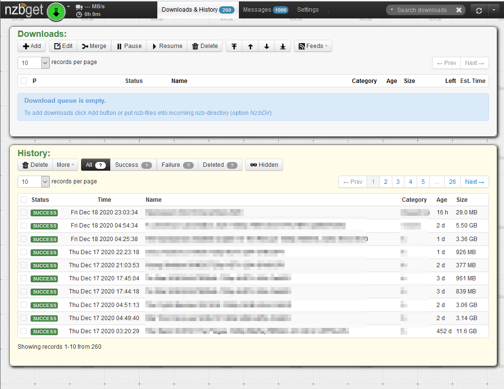

# NBZGet-UI-MOD
 
 
 A while back I thought the NZBGet UI could be improved. I gave it a try and came up with something I liked.
 
 
 
 The main goal was to combine both the Downloads and the History pages into one. I recall reaching out to the NZBGet team and they were not interested in making the change at the time.
  
 I made other CSS edits for a different design style (pleasing to my eyes).
 
 The code has been working well.... there are a couple of small things that can be improved. The changes have held up over time as the NZBGet team has not updated the .html format in a way that would break my mods.
 
 I am an **unRAID** user and use User Scripts. I have created my own script which I execute after every NZBGet Docker update. If you want to use it the same way, you need to edit the script file and change the name of your NZBGet docker. 
 
 **Instructions:**
 1. Download the GitHub zip file.
 2. Copy the corresponding folder contents to your NZBGet Appdata Folder
 3. Copy the corresponding folder contents to your Userscripts Folder 
 4. In the Userscript folder, edit the "script" file and enter the name of your NZBGet folder where shown.
 
 There is a *minor* bug or two in the end result... let's see if you can spot it. If you do, and can help resolve it, you win a prize.
 
 If the UI gets broken in any future release, or if you want to un-install the mods, just do a Forced Update to your NZBGet Docker.
 
 
 
 
